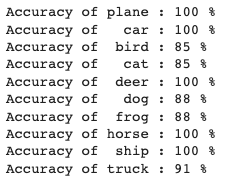

# 🌐 ERA1 Session 10 Assignment 🌐

## 📌 Table of Contents

1. [Problem Statement](#problem-statement)
2. [Introduction](#introduction)
3. [Model Architecture](#model-architecture)
4. [Data Augmentation](#data-augmentation)
5. [Results](#results)
6. [Classwise Accuracy](#classwise-accuracy)
7. [Misclassified Images](#misclassified-images)

## 🎯 Problem Statement

1. Write a customLinks to an external site. ResNet architecture for CIFAR10 that has the following architecture:  
    1. PrepLayer - Conv 3x3 s1, p1) >> BN >> RELU [64k]  
    2. Layer1 -  
        1. X = Conv 3x3 (s1, p1) >> MaxPool2D >> BN >> RELU [128k]  
        2. R1 = ResBlock( (Conv-BN-ReLU-Conv-BN-ReLU))(X) [128k]  
        3. Add(X, R1)  
    3. Layer 2 -  
        1. Conv 3x3 [256k]  
        2. MaxPooling2D  
        3. BN  
        4. ReLU  
    4. Layer 3 -  
        1. X = Conv 3x3 (s1, p1) >> MaxPool2D >> BN >> RELU [512k]  
        2. R2 = ResBlock( (Conv-BN-ReLU-Conv-BN-ReLU))(X) [512k]  
        3. Add(X, R2)  
    5. MaxPooling with Kernel Size 4  
    6. FC Layer  
    7. SoftMax 
2. Uses One Cycle Policy such that:  
    1. Total Epochs = 24  
    2. Max at Epoch = 5  
    3. LRMIN = FIND  
    4. LRMAX = FIND  
    5. NO Annihilation. 
3. Uses this transform -RandomCrop 32, 32 (after padding of 4) >> FlipLR >> Followed by CutOut(8, 8)  
4. Batch size = 512  
5. Use ADAM, and CrossEntropyLoss  
6. Target Accuracy: 90%  
7. NO score if your code is not modular. Your collab must be importing your GitHub package, and then just running the model. I should be able to find the custom_resnet.py model in your GitHub repo that you'd be training.  
8. Once done, proceed to answer the Assignment-Solution page.  

## 📚 Introduction

The goal of this assignment is to design a Convolutional Neural Network (CNN) using PyTorch and the Albumentation library to achieve an accuracy of 85% on the CIFAR10 dataset. The code for this assignment is provided in a Jupyter Notebook, which can be found [here](./ERA1_S10_CIFAR10_Resnet.ipynb).

The CIFAR10 dataset consists of 60,000 32x32 color training images and 10,000 test images, labeled into 10 classes. The 10 classes represent airplanes, cars, birds, cats, deer, dogs, frogs, horses, ships, and trucks. The dataset is divided into 50,000 training images and 10,000 validation images.

## 🏗 Model Architecture

The custom ResNet model for CIFAR10 features a preprocessing layer, three primary layers, and a fully connected (FC) layer. The layers incorporate Convolutional layers, MaxPooling, Batch Normalization, ReLU activations, and Residual Blocks to handle feature extraction and to mitigate the issue of vanishing gradients. The model ends with a SoftMax function for class probability scores, leveraging the depth of the model and residual connections for efficient classification on the CIFAR10 dataset.

## 🎨 Data augmentation 
The model uses data augmentation techniques to improve robustness and prevent overfitting by increasing data diversity. This includes RandomCrop (32, 32), applied after a 4-pixel padding, to enhance positional robustness by randomly cropping images. FlipLR is used for introducing orientation robustness by mirroring images along the vertical axis. Lastly, CutOut (8, 8) randomly masks parts of the image, promoting the model's ability to learn from various regions, thereby improving its robustness to occlusions.

Sample images,  

## 📈 Results

The model was trained for 24 epochs and achieved an accuracy of 91.34% on the test set. 

Trainling accuracy: 94.90 %
Test accuracy: 91.34 %

## 📊 Classwise Accuracy

## ❌ Misclassified Images

Few Samples of misclassified images,  

