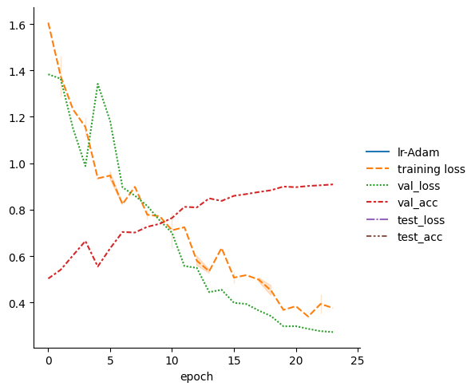
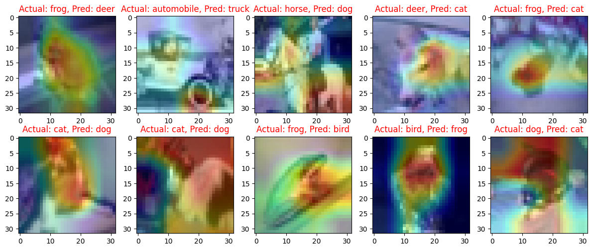

# 🌐 ERA1 Session 12 Assignment 🌐

## 📌 Table of Contents

1. [Problem Statement](#problem-statement)
2. [Introduction](#introduction)
3. [Model Architecture](#model-architecture)
4. [Data Augmentation](#data-augmentation)
5. [Results](#results)
6. [Misclassified Images](#misclassified-images)

## 🎯 Problem Statement

1. Move your S10 assignment to Lightning first and then to Spaces such that:  
    1. (You have retrained your model on Lightning)  
    2. You are using Gradio  
    3. Your spaces app has these features:  
        1. ask the user whether he/she wants to see GradCAM images and how many, and from which layer, allow opacity change as well  
        2. ask whether he/she wants to view misclassified images, and how many  
        3. allow users to upload new images, as well as provide 10 example images  
        4. ask how many top classes are to be shown (make sure the user cannot enter more than 10)  
    4. Add the full details on what your App is doing to Spaces README   
2. Then:  
    1. Submit the Spaces App Link  
    2. Submit the Spaces README link (Space must not have a training code)
    3. Submit the GitHub Link where Lightning Code can be found along with detailed README with log, loss function graphs, and 10 misclassified images

## 📚 Introduction

The goal of this assignment is to design a Convolutional Neural Network (CNN) using PyTorch and the Albumentation library to achieve an accuracy of 85% on the CIFAR10 dataset. The code for this assignment is provided in a Jupyter Notebook, which can be found [here](./ERA1_S12_CIFAR10_Pytorch_lightning.ipynb).

The CIFAR10 dataset consists of 60,000 32x32 color training images and 10,000 test images, labeled into 10 classes. The 10 classes represent airplanes, cars, birds, cats, deer, dogs, frogs, horses, ships, and trucks. The dataset is divided into 50,000 training images and 10,000 validation images.

## 🏗 Model Architecture

The custom ResNet model for CIFAR10 features a preprocessing layer, three primary layers, and a fully connected (FC) layer. The layers incorporate Convolutional layers, MaxPooling, Batch Normalization, ReLU activations, and Residual Blocks to handle feature extraction and to mitigate the issue of vanishing gradients. The model ends with a SoftMax function for class probability scores, leveraging the depth of the model and residual connections for efficient classification on the CIFAR10 dataset.

## 🎨 Data augmentation 
The model uses data augmentation techniques to improve robustness and prevent overfitting by increasing data diversity. This includes RandomCrop (32, 32), applied after a 4-pixel padding, to enhance positional robustness by randomly cropping images. FlipLR is used for introducing orientation robustness by mirroring images along the vertical axis. Lastly, CutOut (8, 8) randomly masks parts of the image, promoting the model's ability to learn from various regions, thereby improving its robustness to occlusions.

## 📈 Results

The model was trained for 24 epochs and achieved an accuracy of 89.64% on the test set. 

## ❌ Misclassified Images with GradCAM

Few Samples of misclassified images,  

