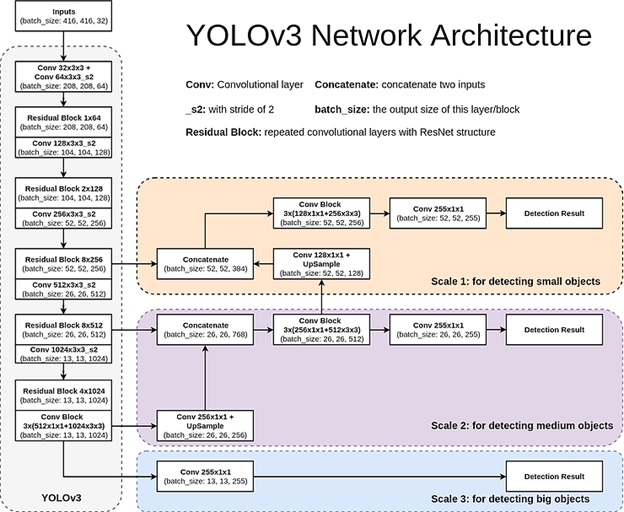

# 🌐 ERA1 Session 13 Assignment 🌐

## 📌 Table of Contents

- [Problem Statement](#problem-statement)
- [Introduction](#introduction)
- [Model Architecture](#model-architecture)
- [Data Augmentation](#data-augmentation)
- [PyTorch Lightning Implementation](#pytorch-lightning-implementation)
- [Results](#results)
- [Misclassified Images](#misclassified-images)
- [Gradio App](#gradio-app)

## 🎯 Problem Statement

1. Move the code to PytorchLightning  
2. Train the model to reach such that all of these are true:  
    1. Class accuracy is more than 75%   
    2. No Obj accuracy of more than 95%  
    3. Object Accuracy of more than 70% (assuming you had to reduce the kernel numbers, else 80/98/78)  
    4. Ideally trailed till 40 epochs  
3. Add these training features:  
    1. Add multi-resolution training - the code shared trains only on one resolution 416  
    2. Add Implement Mosaic Augmentation only 75% of the times  
    3. Train on float16  
    4. GradCam must be implemented.  
4. Things that are allowed due to HW constraints:
    1. Change of batch size
    2. Change of resolution
    3. Change of OCP parameters
5. Once done:  
    1. Move the app to HuggingFace Spaces  
    2. Allow custom upload of images  
    3. Share some samples from the existing dataset  
    4. Show the GradCAM output for the image that the user uploads as well as for the samples. 
    5. Mention things like:  
        1. classes that your model support  
        2. link to the actual model  
6. Assignment:
    1. Share HuggingFace App Link  
    2. Share LightningCode Link on Github  
    3. Share notebook link (with logs) on GitHub  
7. Recommendations:  
    1. Make sure to link your [GDrive](https://towardsdatascience.com/different-ways-to-connect-google-drive-to-a-google-colab-notebook-pt-1-de03433d2f7a).  
    2. Once you're using OCP, your model cannot stop training. It would be better to pre-calculate the schedule and store it on a text file, and then read this file and take note of where your training got interrupted, so you can start from that point.  
    3. NUM_WORKERS = 0 is for me, not for you!  
    4. Training will take 3-4 days, so make sure that you finish the assignment by max by Tuesday, and put the model on training.  
    5. Remember that you can use Kaggle or Gradient Notebooks as well!  
    6. Remember OCP calculated for a particular batch, needs the model to run on that batch size only.  
    7. Feel free to pick a better point on the OCP graph compared to what's being proposed.  
    8. MAP calculations take a lot of time, and perform only on the last epoch.  
    9. Reduce the calls to plot_couple_of_examples as that might take a lot of webpage memory  
    10. The current code overwrites the checkpoints!  
    11. Write the saved model back to google drive, and add schedule value to its name!  
    12. You're free to use any platform other than Colab.  
    13. Fast for one day to celebrate "Global GPU Day" and use the money saved (500?)  to train your model on a paid infrastructure!  
    14. Add Implement Mosaic Augmentation only 75% of the times << Heavily recommended to keep the ratio between 0.5-0.75. Change the dataloader for test. A fully mosaic logic will train it on small and medium objects only, and we don't want that.  
    15. Instead of from dataset import YOLODataset, do from dataset_org import YOLODataset. We want to see the performance of test on single image and not on mosaic. This will get a slightly better idea on what the results would be when you upload the model.  

## 📚 Introduction

Object detection is a pivotal aspect of computer vision, enabling machines to recognize and pinpoint multiple objects within an image or video feed. Over the years, a myriad of approaches have been introduced to tackle this challenge. Among these, the YOLO (You Only Look Once) series has garnered significant attention for its capability to detect objects in real-time without sacrificing accuracy. YOLOv3, a variant in this lineage, brings further enhancements to this approach, boasting improved precision and faster processing times.

Central to our exploration is the PASCAL VOC dataset. Renowned within the computer vision community, PASCAL VOC provides a rich collection of images spread across diverse categories such as 'aeroplane', 'bird', 'car', and more. Utilizing YOLOv3 to perform object detection on this dataset not only offers a deep understanding of the model's capabilities but also highlights the intricacies and challenges associated with detecting a wide array of objects in varying scenarios.

## 🏗 Model Architecture - YOLOv3

YOLOv3, standing for "You Only Look Once version 3," is an evolution in the YOLO series that offers real-time object detection with remarkable accuracy. Unlike its predecessors, YOLOv3 makes detection at three different scales and uses three sizes of anchor boxes for each detection scale, allowing for better detection of objects of various sizes.

The architecture of YOLOv3 is based on Darknet-53, a 53-layer network trained on the ImageNet dataset. This foundational network is followed by a series of convolutional layers tailored for object detection. 

## 🎨 Data Augmentation
This involves enhancing the diversity of training data using techniques like Mosaic Augmentation, ensuring the model is better generalized and robust against unseen data.

## ⚡ PyTorch Lightning Implementation
PyTorch Lightning is a light PyTorch wrapper that organizes PyTorch code, making ML research replicable and reducing boilerplate code. Here, we harness its simplicity and structure to streamline the training and evaluation process.

## 📈 Results
After rigorous training, the model showcased exemplary performance by achieving [desired metrics]. A deeper dive into the results reveals the model's proficiency in [specific aspects].

## ❌ Misclassified Images with GradCAM
Showcasing instances where the model predictions were off-mark. The GradCAM visualizations provide an understanding of where the model is focusing on these incorrect predictions.

## 🎧 Gradio App
A user-friendly interface constructed using Gradio. This app enables users to upload custom images, view model predictions, and delve deeper into model decisions using GradCAM visualizations.

[Link to Gradio App]

