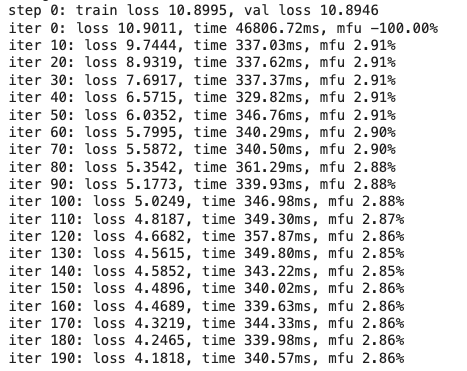

# 🌐 ERA1 Session 16 Assignment: Training Baby GPT from Scratch 🌐

## 📌 Table of Contents
- Problem Statement
- Introduction
- Model Architecture
- PyTorch Lightning Implementation
- Training
- Results
- HuggingFace App
- Gradio Interface

## 🎯 Problem Statement
Assignment
- Go through [this](https://www.youtube.com/watch?v=kCc8FmEb1nY&t=40s) video and train your GPT from scratch. 
- Upload the model to HuggingFace Apps, and share the link. 

## 📚 Introduction
In this session, we dive into the world of transformers by training a smaller version of the GPT model, known as "nanoGPT", from scratch. This exercise aims to deepen understanding of transformer architectures and their training process.

## 🏗 Model Architecture - nanoGPT
- Number of layers: 6
- Number of attention heads: 6
- Embedding dimension: 384
- Dropout rate: 0.2

## ⚡ Training Notebook
Training Notebook: [link](./ERA1_Session21_nanoGPT.ipynb)

## 📈 Results

## 🎧 HuggingFace App
The trained model is uploaded to HuggingFace Apps, enabling easy sharing and access. Link to the model: (insert link here)

## 🎨 Gradio Interface
A user-friendly interface is created using Gradio, allowing users to interact with the trained model, generating text based on custom input.

Link to Gradio Interface: (insert link here)

## 📺 Reference Video
[Training GPT from scratch](https://www.youtube.com/watch?v=kCc8FmEb1nY&t=40s)
