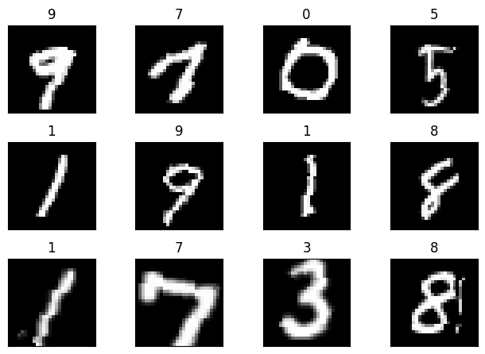
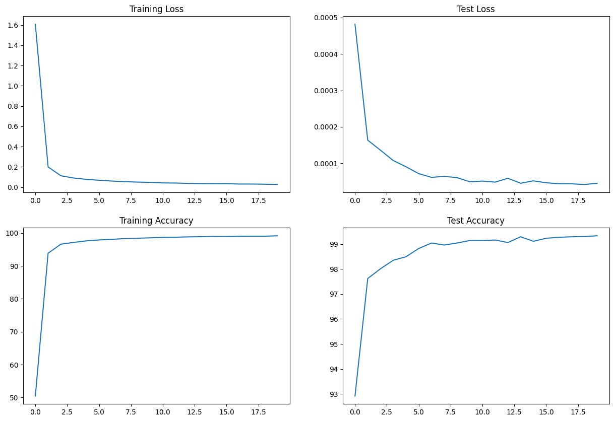

# 📚 ERA1 Session 5 PyTorch Assignment

## 📝 Table of Contents
1. [🎯 Introduction](#introduction)
2. [📂 File Structure](#file-structure)
3. [🔍 Overview of the Dataset](#overview-of-the-dataset)
4. [📈 Training and Test Accuracy](#training-and-test-accuracy)
5. [📊 Plotting Loss and Accuracy](#plotting-loss-and-accuracy)
6. [🧠 Understanding the Code](#understanding-the-code)

## 🎯 Introduction

This is the readme file for the Session 5 PyTorch Assignment. The assignment involves reorganizing code into separate files and ensuring the code runs successfully. The code consists of a PyTorch model built for some machine learning task, with the utility functions and main code each placed in separate files.

## 📂 File Structure

- `model.py` : This file contains the PyTorch model, and the functions related to training the model and getting the model summary.
- `utils.py` : This file contains utility functions such as loading the data and visualizing the data.
- `S5.ipynb` : This is the main Jupyter notebook file that contains the code which uses the model and utility functions to execute the machine learning task.
- `README.md` : This is the file you are currently reading. It provides a detailed explanation of the assignment and the code.

## 🔍 Overview of the Dataset

The dataset used in this assignment is the MNIST dataset. This dataset consists of images of handwritten digits, each 28x28 pixels. There are 60,000 training images and 10,000 testing images. Each image is labeled with the digit it represents, from 0 to 9.

### 🖼️ Sample Images

The `getSampleImages` function in `utils.py` is used to display some sample images from the training data. This gives an idea of the kind of images the model is being trained on. The images are grayscale and show handwritten digits from 0 to 9.

## 🧠 Understanding the Code

The code is broken down into different files for organization and readability:

- `model.py` : This file begins with the definition of the PyTorch model, `Net`. This model is a convolutional neural network built using PyTorch's `nn.Module`. Following this, there are several functions for training the model, getting a summary of the model, and visualizing the training and test plots.

- `utils.py` : This file contains functions for handling the data. The `getDataLoader` function is used to load the training and testing data. The `getSampleImages` function is used to visualize some sample images from the training data.

- `S5.ipynb` : This notebook is the main file where the code is executed. It starts by checking for CUDA availability and setting the device accordingly. It then imports the utility functions and loads the data. It also imports the model and related functions, and initializes the model. The model is then trained and evaluated using the training and testing data, and the training and testing accuracy and loss plots are visualized.

## 📈 Training and Test Accuracy

The model achieves a training accuracy of approximately **99.16%** and a test accuracy of approximately **99.33%**. These values indicate that the model performs well on both the training data and unseen test data.

## 📊 Plotting Loss and Accuracy

The `getTrainingTestPlots` function in `model.py` is used to plot the training and test losses and accuracies. These plots provide a visual representation of how the model's performance changes over the course of training. The loss plots show how the model's error decreases over time, and the accuracy plots show how the model's performance improves.

