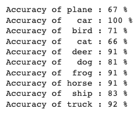

# ERA1 Session 9 Assignment

## Problem Statement

1. Write a new network that   
    1. has the architecture to C1C2C3C40 (No MaxPooling, but 3 convolutions, where the last one has a stride of 2 instead) (If you can figure out how to use Dilated kernels here instead of MP or strided convolution, then 200pts extra!)  
    2. total RF must be more than 44  
    3. one of the layers must use Depthwise Separable Convolution  
    4. one of the layers must use Dilated Convolution  
    5. use GAP (compulsory):- add FC after GAP to target #of classes (optional)  
    6. use albumentation library and apply:  
        1. horizontal flip  
        2. shiftScaleRotate  
        3. coarseDropout (max_holes = 1, max_height=16px, max_width=16, min_holes = 1, min_height=16px, min_width=16px, fill_value=(mean of your dataset), mask_fill_value = None)  
    7. achieve 85% accuracy, as many epochs as you want. Total Params to be less than 200k.  
    8. make sure you're following code-modularity (else 0 for full assignment) 
    9. upload to Github  
    10. Attempt S9-Assignment Solution.  
    11. Questions in the Assignment QnA are:  
        1. copy and paste your model code from your model.py file (full code) [125]  
        2. copy paste output of torch summary [125]  
        3. copy-paste the code where you implemented albumentation transformation for all three transformations [125]  
        4. copy paste your training log (you must be running validation/text after each Epoch [125]  
        5. Share the link for your README.md file. [200]  

## Introduction

The goal of this assignment is to design a Convolutional Neural Network (CNN) using PyTorch and the Albumentation library to achieve an accuracy of 85% on the CIFAR10 dataset. The code for this assignment is provided in a Jupyter Notebook, which can be found [here](./EVA8_S6_CIFAR10.ipynb).

The CIFAR10 dataset consists of 60,000 32x32 color training images and 10,000 test images, labeled into 10 classes. The 10 classes represent airplanes, cars, birds, cats, deer, dogs, frogs, horses, ships, and trucks. The dataset is divided into 50,000 training images and 10,000 validation images.

## Model Architecture

The model for this project is based on the C1C2C3C40 architecture with several modifications. Instead of max pooling, the network consists of 3 convolutional layers with 3x3 filters and a stride of 2. The final layer utilizes global average pooling (GAP). One layer uses depthwise separable convolution, while another layer uses dilated convolution. The architecture leverages mobileNetV2, which combines expand, depthwise, and pointwise convolution with residual connections.
Data Augmentation

## Data augmentation 
Augmentation is performed using the Albumentations library. Three techniques are applied in the training data loader: horizontal flipping, shiftScaleRotate, and coarseDropout. No dropout was included in the model as these data augmentation methods provide similar regularization effects.

Sample images,  

## Results

The model was trained for 25 epochs and achieved an accuracy of 84.64% on the test set. The total number of parameters in the model was under 200k. The training logs, as well as the output of torchsummary, are included in this notebook.

Trainling accuracy: 82.84 %
Test accuracy: 84.64 %

## Classwise Accuracy

## Misclassified Images

Few Samples of misclassified images,  

